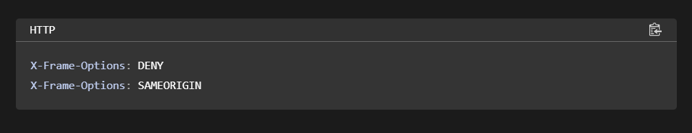
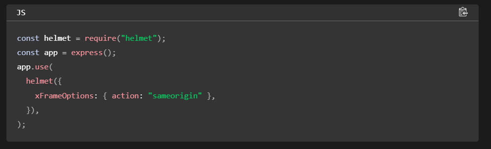
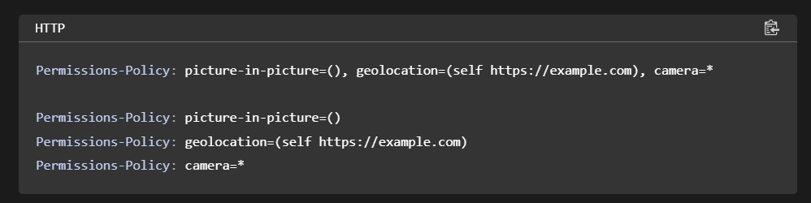
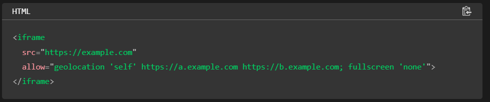

# FRONTEND SYSTEM DESIGN

## Security

Content Security Policy (CSP) is a set of rules given to the browser to prevent certain types of attacks like XSS, data injection, etc. It is an added layer of security that helps to detect and mitigate from certain types of attacks.

CSP headers can be used to restrict the sources.

### XSS(Cross Site Scripting)
XSS attacks occurs when attacker injects and executes unauthorised scripts into web pages.

#### Preventing techniques
- **Proper Input Validation.**
- **Sanitization :** It is the process of inspecting and cleansing user to input to prevent malicious code injection. This is typicallydone vy removing or escaping charaters that could be interpreted as code. IT helps from xss, SQL injection, etc.

Syntax :
``` 
Directive <sources>

app.use((req,res,next)=>{
    res.setHeader('Content-Security-Policy',"default-src" 'self'; "img-src" 'self' 'https://api.com'; );
    next();
}) 
```

**"default-src" 'self' :** To set default source for various contents like scripts, stylesheets, images, etc. 'self' means load the contents from the same origin. We can set the particular domain also.

There are different fetch directives like script-src, img-src, style-src, font-src, media-src, frame-src, child-src, etc.


For Document directives :- base-uri and sandbox.

For Navigation directives :- form-action, frame ancestors.

The value of sources :-
- **'host-source' :** allow the scripts from the particular domain. eg, https://api.com.
- **'self' :** Scripts can be loaded from the same origin, part as the websites.
- **'Unsafe-inline' :** allow inline js to executes. Generally, considered unsafe due to XSS attacks.
- **'nonce-randomKey' :** Scripts can be loaded with specific nounce value that must match the nonce value provided in the scripts 'nonce' attribute.


### i-frame Protection
X-frame-options arethe http response header can be used to indicate whether a browser allowed to render page in a ``` <frame> ```, ``` <iframe> ```, ``` <embed> ``` or ``` <objects> ```. It is the used to prevent site from clickjacking events.

**Clickjacking** is the type of attacks where a malicious website tricks a user into clicking on something different from what the user perceives. This is typically achieved by overlaying the target website with an invisible or opaque element such as an iframe.

Syntax :





#### Prevention
There are to values of iframe directive :
- **DENY :** Page cannot be displayed in a frame.
- **SAMEORIGIN :** The page can only be displayed if all ancestor frames are the same origin.

**for Frontend :**

    if(window !== window.top){
        window.top.location.href = window.location.href;
    }


### Referrer-Policy

It allows website owners to control how much referrer information is disclosed to external websites, balancing privacy concerns with functionality requirements.

It helps to control the information about referring URL should be included in requests made from a web browser. It is used to maintain the security and privacy of the source.

Syntax: 

``` Referrer-Policy : directives```

``` <meta name="referrer" content="origin" />```

#### The Directives includes :
- **no-referrer :** Request does not includes any referrer information.
- **no-referrer-when-downgrade :**
- **origin :** send only the origin in the referrer.
- **origin-when-cross-origin :** 
- **same-origin :** Send the origin for same-origin requests. Don't send the Referer header for cross-origin requests.
- **strict-origin :** Send only the origin when the protocol security level stays the same (HTTPS→HTTPS).
- **strict-origin-when-cross-origin (default) :** Send the origin, path, query when same origin. For cross origin, send only origin when the security protocol remains same (HTTPS→HTTPS).Don't send referrer for less secure destination (HTTPS→HTTP).


### X-Powered-By : 
"X-Powered-By" is an HTTP response header that some web servers include in their responses to indicate the technology stack (like PHP, ASP.NET, or Node.js) used to generate the web page.It can provide insights for developers and server administrators, it can also potentially expose information about the server's infrastructure to attackers. To prevent this, we need to this removeHeader from the backend.

Syntax:

```response.removeHeader("X-Powered-By");```


### HTTPs Strict-Transport-Security (HSTS):
Strict-Transport-Security (HSTS) is an HTTP header that instructs web browsers to only connect to a website over a secure, encrypted connection (HTTPS) and to automatically convert any insecure HTTP requests to HTTPS. Once a browser receives the HSTS header from a website, it will remember to enforce HTTPS for subsequent visits to that site for a specified period of time (the "max-age" directive), even if the user enters an HTTP URL or clicks on HTTP links.

It reduces the risk of man-in-the-middle attacks and unauthorized interception of sensitive information.

#### Syntax:

```Strict-Transport-Security: directive ```

#### The Directives includes :
- **max-age=<expire-time> :** The time, in seconds, that the browser should remember that a site is only to be accessed using HTTPS.
- **includeSubDomains(optional) :** This ensures that HTTPS is enforced across the entire domain hierarchy, enhancing security for all subdomains.
- **Preload :** In preloading, Browsers include them in a predefined list of HSTS-enabled sites. This ensures that even when user's first visit to the site is automatically upgraded to HTTPS.


### Dependency Security

- **Regular Audit of dependencies** (npm audit, npm update)
- **Enforcing Auditing** (npm set audit true)
- **code & Dependency monitor** (codeql)
- **Dependency Locking** (Package-lock.json)
- **Security Penetraion Testing using tools**


### Server Side Request Forgery(SSRF)

SSRF is the type of attack in which attacker tries to gain the access of the internal system, service or data. Attacker sends the malicious code inside the payload which excutes in the server which leads to unauthorized access to the attacker.

#### Preventing the system from SSRF
- **Input Validaiton**
- **WhiteListing** (Specify domain/IP address that the application can communicate)
- **URL Parsing**
- **Firewalls**
- **Content Security Policy (CSP)**
- **Security Headers**

### Permission-Policy
The HTTP Permissions-Policy header provides a mechanism to allow and deny the use of browser features in a document.

Syntax:

``` Permissions-Policy: <directive>=<allowlist>```

#### Allowedlist are :
-  **\* :** Allow all the domains.
- **() :** Allow none.
- **self :** Allow on only document not nested(iframe).
- **src :** 
- **<origins> :** The feature is allowed for specific origins.

#### Directives includes **Battery, Camera, display-capture, fullscreen, geolocation, etc.**






### Subresource Integrity
Subresource Integrity is the security feature that allows developers to ensures that the resources hosted on the third-party servers have not been tempered/modified. It works by adding a cryptographic hash of the resource's content to the HTML markup. When the browser fetches the resource, it recalculates the hash and compares it to the one provided in the markup. If the hashes match, the resource is considered valid and safe to use. If they don't match, it indicates that the resource has been modified, and the browser will block its execution or display to prevent potential security risks.

#### Flow :
- Browser download the resources.
- Generate cryptographic hash using content + algo.
- Commpares both hash. If matches then good to go otherwise browser stops the excution.


### Cross Origin Resource Sharing(CORS)
